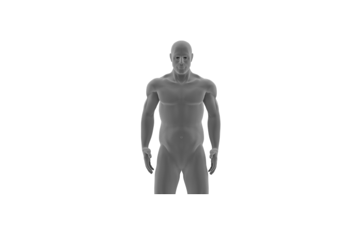
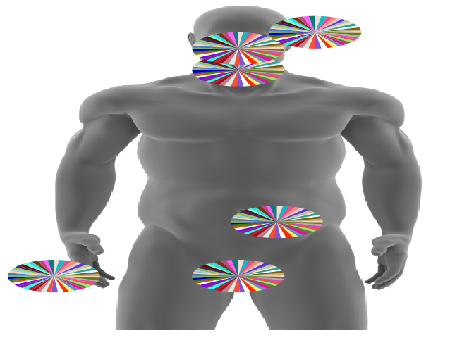

The objective here is to overlay a series of piecharts on top of an
existing image. This exercise was based on a microbiome sequence of the
diversity of microbes (based on the sequence identification) and their
abundance from different regions of skin on a human subject. The
original data are removed for privacy and for pre-publication purposes,
and random data are generated for this exercise.

Generate Random Abundance Data
==============================

Generate some random data. Actual values or units are not important
here. In this case, 6 different body regions were measured so we
generate 50 random numbers \* 6 regions. Arbitrarily the mean = 0 and sd
= 1.

    dat<-as.data.frame(replicate(50, rnorm(6, mean=10, sd=1)))

Although not necessary, sometimes when creating random data you want to
label the data. So here is code for creating random letters

Label the rows to correspond to the body regions from which these were
derived

    colnames(dat)<-replicate(50, paste(sample(LETTERS, 3, replace=TRUE), collapse=""))

We can also define the differnt rows on the basis of the region.

    rownames(dat)<-c("ear","genital","gut","LH","mouth","nose")
    head(dat)

    ##               OVO       IUN       TXQ       IVQ       MFI       LWI
    ## ear     10.680655 10.958222 10.190825  9.302429  8.474027  9.166619
    ## genital 10.835269  9.431091 10.232441  9.321116 10.221347 11.139602
    ## gut     11.312334 10.343040 10.477421  9.420945 10.110039  9.482060
    ## LH       9.183921 11.161976 10.438090 11.105501  9.655614 10.423616
    ## mouth    9.688664 11.148232  7.783668  9.408734 10.921143 10.716005
    ## nose     8.404963 10.395944  7.423829  9.038997  9.846594  9.790255
    ##               HUZ       RPR       TJI       EWL       QYS       HHR
    ## ear     11.126531 10.145136 11.693793  9.648042 10.049209  9.051469
    ## genital 10.171055 10.834127  8.689878  8.754030  9.432800 10.177262
    ## gut     10.529869  8.417809  8.910194  8.183943 10.522050 10.321544
    ## LH       9.787175 11.024458  9.653525 10.544710  8.125291 10.621573
    ## mouth    9.779173  9.190502 11.201939 10.026703  9.566096  9.295180
    ## nose     9.267746 10.673684 10.582264 11.208918  9.447552  9.307238
    ##               WWG       TUL       DSN       SJI       QTW       WKD
    ## ear      8.352500 10.697216 11.143145  9.989172  9.305782  9.203686
    ## genital 10.193001  9.680259  8.564587 10.332075 10.203079 10.542465
    ## gut      8.454057  8.784014 10.529560  8.561646 11.263825 10.846669
    ## LH      10.160568 11.398563  8.307084  8.797770 11.400028  9.734418
    ## mouth   10.727668 11.667718  8.146896  9.362517  9.542120 10.818458
    ## nose    10.883071  8.693545  8.740312  9.086203  9.730342 10.382199
    ##               LII       FUE       PEZ       CTT       UAF       NLL
    ## ear     10.182312 10.217144  9.164324 11.180097  9.621469 10.399373
    ## genital  9.877171  9.437900 10.716279 11.154089 10.624896  9.738724
    ## gut     11.639508 11.863824 10.435441  9.361308 12.168296  9.492511
    ## LH       9.547718  8.968761 10.915218  9.417844  9.334079  9.882041
    ## mouth   10.309506  9.329273  9.672837 10.477731 10.243045 11.689552
    ## nose     9.519067 10.501858 10.727552  8.764986 12.451416 10.915238
    ##               YMG       VJU       BMN       GIC      UJE       WQE
    ## ear     10.482632 12.008037  9.946742 10.174703 8.745971  9.683061
    ## genital  9.538957 11.292844 10.646018 10.490081 7.976755  9.689866
    ## gut     10.787998 10.814743 10.999440 10.227029 9.098330  9.374434
    ## LH      10.862840  9.798680  9.203063  8.878426 7.849101  9.409173
    ## mouth   10.520811 11.161323 12.378446 10.166119 9.306408  9.027614
    ## nose     9.918506  8.505669 11.203035 10.734766 9.893426 11.576720
    ##               HVX       OPE       RAY       GQQ       XTB       NQJ
    ## ear     11.271434  9.538280  9.062918 10.959898  9.555079 10.207554
    ## genital 12.310540  8.993601 10.171789  9.456687  9.870011  9.532217
    ## gut      9.008396  9.307431  9.126799 10.329739 11.441380  8.808895
    ## LH      10.785289 10.505187 10.241466  8.670021  8.516082 11.244179
    ## mouth    9.980754 11.116521 10.101393  9.510366 10.025637  8.138374
    ## nose     9.563084  9.705338  9.739229 12.422014  9.549360  8.530785
    ##               MVG       GFH       CIA       BLO       JTN       YVW
    ## ear      9.783225 11.223734 11.235329  7.257561  9.277900 10.078149
    ## genital  8.795113 11.633688  9.480509 10.204493  9.474139  9.882633
    ## gut      8.970184  9.948913 10.113051  9.487890 10.742361 12.558757
    ## LH      10.734500  9.905529  9.552908  9.896668  9.540383  9.916768
    ## mouth   11.123729 10.424096  8.523051  8.234865  8.411736  9.926603
    ## nose    10.156571  9.205020  9.194100 10.175207 11.269201 10.227977
    ##               KAB       LUV       JJT       STF       LVV       QTA
    ## ear     10.613994  8.736415 11.610796  7.921762 10.015277 10.495521
    ## genital  9.994559 10.545440  8.824115 11.834912 11.020905 10.727914
    ## gut     10.597731  8.156955  8.880485 10.050454  9.276469  8.044190
    ## LH      10.045289 10.324778  9.821879  9.585300 10.068237  9.968344
    ## mouth    9.038431  9.355769 12.231333 10.957772 12.476530  7.378406
    ## nose    10.689124 10.506281  9.399852  8.919273  9.517737  9.767099
    ##               VQV       VKQ
    ## ear     10.438157 11.129634
    ## genital 10.186260 11.398007
    ## gut      7.624362 11.443431
    ## LH       7.602100 10.745277
    ## mouth    9.034624 10.177895
    ## nose    10.368876  8.728968

Create a Relative Abundance Plot using scatterpie
=================================================

You'll need to install 3 libraries: "png", "grid", and "scatterpie"

    library(png)
    library(grid)
    library(scatterpie)

    ## Loading required package: ggplot2

First load in your png or jpg graphic upon which you want to plot your
scatterplots. If you use the **as.raster()** you can convert the loaded
image file into a rasterised image that readily plots.

    img <- readPNG( "aac_human_body.png")
    plot(as.raster(img))

To use your graphic within the R ggplot environment, you will need to
convert it to a grob, or specifically into a rasterGrob.

This allows you to include the png within the ggplot space. If you
change the width or height, you can alter the aspect ratio. Keeping
width and height = 1 retains the image aspect ratio. You can use the x
and y options to place your graphic left/right or up/down within the
plotting space.

We will set width to 0.8 to make the graphic a little more svelt:

    g<-rasterGrob(img, width=unit(0.8,"npc"), height=unit(1,"npc"), interpolate = FALSE)

We'll now use this rasterGrob below in the ggplot call, but first we
need to decide where we want our scatter pie charts to go on top of this
rasterGrob.

We do this by adding x, y, and radius coordinates to determine the
placement (x,y) and size (radius) of pie charts. We'll call these imX,
imY, and r and add them individually to the working data.frame, dat:

    dat$imX<-c(2, 1.5, 1.75, 0.3, 1.5, 1.5)
    dat$imY<-c(5.5, 1, 2, 1, 4.8, 5.2)
    dat$radius<-0.3

These numbers above are note necessarily intuitive, and you may need to
tinkering with them. But one thing to understand is that x,y = 0,0
corresponds to the lower left of the plot window, while x,y = maxX, maxY
corresponds to the upper right corner of the window.

So, when you create the final ggplot geom below, you will need to set
your x and y limits to xlim(0,3) and ylim(0,6). At the moment, I don't
follow how you ascertain what these values should be and why they are
not simply 0 to 1. The help for scatterpie is terrible, thus making it
difficult to figure some reasons out.

Create colour palette for the pie chart
=======================================

R has a built in list of colours that you can see by running the
**colors()** function:

    length(colors())

    ## [1] 657

    head(colors())

    ## [1] "white"         "aliceblue"     "antiquewhite"  "antiquewhite1"
    ## [5] "antiquewhite2" "antiquewhite3"

Use the **grep()** function to search for any entry that mentions grey
or gray in order to create a list of only colours. There are &gt; 200
colours that are technically gray, so we will create a new vector of
colors, called allcolors that represents all the colours except the
greyscales. Then we draw a random sample of 35 colours from allcolours.

    length(grep('gr(a|e)y', grDevices::colors()))

    ## [1] 224

    allcolors = grDevices::colors()[grep('gr(a|e)y', grDevices::colors(), invert = T)]
    colors35<-sample(allcolors,35)

Now, finally, the plot!

    ggplot(dat)+
      annotation_custom(g, xmin=-Inf, xmax=Inf, ymin=-Inf, ymax=Inf)+
      geom_scatterpie(aes(x=imX, y=imY,r=radius),
                      data=dat, cols=colnames(dat)[1:50],color=NA) +
      scale_fill_manual(values=sample(allcolors,50)) +
      scale_x_continuous(expand=c(0,0), lim=c(0,3)) +
      scale_y_continuous(expand=c(0,0), lim=c(0,6)) +
      #annotate("text", x=label_df$Xloc, y=label_df$Yloc+0.4,
      #         label= label_df$label)+
      theme(legend.position="none",
            panel.background = element_rect(fill = "transparent") # bg of the panel
            , plot.background = element_rect(fill = "transparent") # bg of the plot
            , panel.grid.major = element_blank() # get rid of major grid
            , panel.grid.minor = element_blank(), # get rid of minor grid
            line = element_blank(),
            text = element_blank(),
            title = element_blank()
      )  

Finally save the document.

    # ggsave('Fig4v2_wholebody_cutLH_cutbody_pies_col4.png', height=10, width = 5, units = 'in',dpi=300)
