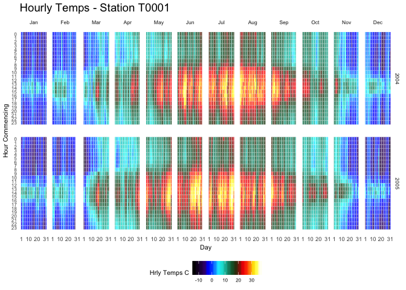
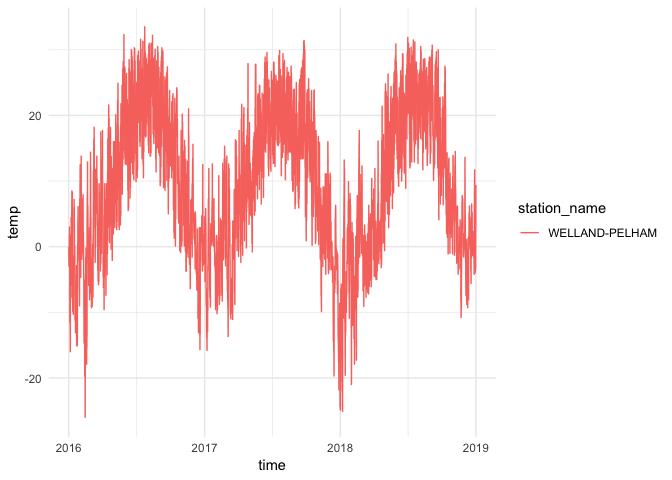
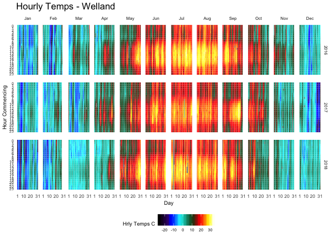

Heat Maps of Weather Data
=========================

Code Sourced from:
<https://gist.github.com/johnmackintosh/520643a1f82a0c7df00cf949ba98a4e9>

    rm(list=ls())

    library(ggplot2)    # required for the geom_tile
    library(viridis)    # colour blind friendly palette, works in B&W also

    ## Loading required package: viridisLite

    library(Interpol.T) # will generate a large dataset on initial load

    ## Loading required package: date

    ## Loading required package: chron

    library(lubridate)  # for easy date manipulation

    ## 
    ## Attaching package: 'lubridate'

    ## The following objects are masked from 'package:chron':
    ## 
    ##     days, hours, minutes, seconds, years

    ## The following object is masked from 'package:base':
    ## 
    ##     date

    library(ggExtra)    # remembering ggplot theme options is beyond me
    library(tidyr)      # for data wrangling
    library(dplyr)      # for data wrangling 

    ## 
    ## Attaching package: 'dplyr'

    ## The following objects are masked from 'package:lubridate':
    ## 
    ##     intersect, setdiff, union

    ## The following objects are masked from 'package:stats':
    ## 
    ##     filter, lag

    ## The following objects are masked from 'package:base':
    ## 
    ##     intersect, setdiff, setequal, union

Load the data into the working environment using the data command. This
will create a number of variables. The one we want is the h\_d\_t
data.frame that we will add names to the relevant columns:

    data<- data(Trentino_hourly_T, package = "Interpol.T")
    names(h_d_t)[1:5]<- c("stationid","date","hour","temp","flag")

Create a working data.frame, df, which filters out aall other stations
and keeps only stationid T0001. Then use the mutate function from dplyr
to add new variables to the df data.frame. These new variables are
simply the extrated year, month, and day, derived from the date variable
within the data.frame:

    df<- tbl_df(h_d_t) %>%
      filter(stationid =="T0001")

    df<-droplevels(df)

    df<- df %>% mutate(year = year(date),
                       month = month(date, label=TRUE),
                       day = day(date))
    anyNA(df$temp)

    ## [1] TRUE

    sum(is.na(df$temp))

    ## [1] 5

Note how there some NA values in the temperature data. In fact there are
5 NA values. Although this is frowned upon, for illustration purposes we
will fill those NA values with the previous value. Technically you
should not do this with real data, but I am showing this to demonstrate:

    df <-df %>% select(stationid,day,hour,month,year,temp) %>%
      fill(temp) #optional - see note below

Now create the heat map
-----------------------

    statno <-unique(df$stationid)
    library(Thermimage) # access to a high contrast paleette (rainbow1234palette)

    p <-ggplot(df,aes(day,hour,fill=temp))+
      geom_tile(color= "white", size=0.1)+
      # scale_fill_viridis(name="Hrly Temps C",option ="B")
      scale_fill_gradientn(name="Hrly Temps C", colours=rainbow1234pal)+
      facet_grid(year~month)+
      scale_y_continuous(trans = "reverse", breaks = unique(df$hour))+
      scale_x_continuous(breaks =c(1,10,20,31))+
      theme_minimal(base_size = 8)+
      labs(title= paste("Hourly Temps - Station",statno), x="Day",
                  y="Hour Commencing")+
      theme(legend.position = "bottom")+
      theme(plot.title=element_text(size = 14))+
      theme(axis.text.y=element_text(size=6)) +
      theme(strip.background = element_rect(colour="white"))+
      theme(plot.title=element_text(hjust=0))+
      theme(axis.ticks=element_blank())+
      theme(axis.text=element_text(size=7))+
      theme(legend.title=element_text(size=8))+
      theme(legend.text=element_text(size=6))+
      removeGrid() #ggExtra
    p

Now let's try this on some Environment Canada Historical Weather data.

Source: <https://github.com/ropensci/weathercan>

Install the weathercan package using the following. Remember ot remove
the \# to run this on your machine if you have never installed packages
from github before:

    # install.packages("devtools") # If not already installed
    # devtools::install_github("steffilazerte/weathercan") 

    library(weathercan)
    library(dplyr)
    library(lubridate)
    library(ggplot2)

Once you have weathercan installed you can glance at what weather
stations have data:

    head(stations)

    ## # A tibble: 6 x 13
    ##   prov  station_name station_id climate_id WMO_id TC_id   lat   lon  elev
    ##   <fct> <chr>        <fct>      <fct>      <fct>  <fct> <dbl> <dbl> <dbl>
    ## 1 AB    DAYSLAND     1795       301AR54    <NA>   <NA>   52.9 -112.  689.
    ## 2 AB    DAYSLAND     1795       301AR54    <NA>   <NA>   52.9 -112.  689.
    ## 3 AB    DAYSLAND     1795       301AR54    <NA>   <NA>   52.9 -112.  689.
    ## 4 AB    EDMONTON CO… 1796       301BK03    <NA>   <NA>   53.6 -114.  671.
    ## 5 AB    EDMONTON CO… 1796       301BK03    <NA>   <NA>   53.6 -114.  671.
    ## 6 AB    EDMONTON CO… 1796       301BK03    <NA>   <NA>   53.6 -114.  671.
    ## # … with 4 more variables: tz <chr>, interval <chr>, start <int>,
    ## #   end <int>

    glimpse(stations)

    ## Observations: 26,217
    ## Variables: 13
    ## $ prov         <fct> AB, AB, AB, AB, AB, AB, AB, AB, AB, AB, AB, AB, AB,…
    ## $ station_name <chr> "DAYSLAND", "DAYSLAND", "DAYSLAND", "EDMONTON CORON…
    ## $ station_id   <fct> 1795, 1795, 1795, 1796, 1796, 1796, 1797, 1797, 179…
    ## $ climate_id   <fct> 301AR54, 301AR54, 301AR54, 301BK03, 301BK03, 301BK0…
    ## $ WMO_id       <fct> NA, NA, NA, NA, NA, NA, NA, NA, NA, NA, NA, NA, NA,…
    ## $ TC_id        <fct> NA, NA, NA, NA, NA, NA, NA, NA, NA, NA, NA, NA, NA,…
    ## $ lat          <dbl> 52.87, 52.87, 52.87, 53.57, 53.57, 53.57, 52.15, 52…
    ## $ lon          <dbl> -112.28, -112.28, -112.28, -113.57, -113.57, -113.5…
    ## $ elev         <dbl> 688.8, 688.8, 688.8, 670.6, 670.6, 670.6, 838.2, 83…
    ## $ tz           <chr> "Etc/GMT+7", "Etc/GMT+7", "Etc/GMT+7", "Etc/GMT+7",…
    ## $ interval     <chr> "day", "hour", "month", "day", "hour", "month", "da…
    ## $ start        <int> 1908, NA, 1908, 1978, NA, 1978, 1987, NA, 1987, 198…
    ## $ end          <int> 1922, NA, 1922, 1979, NA, 1979, 1990, NA, 1990, 199…

Let's search for a nearby station:

    stations_search("Welland", interval = "hour")

    ## # A tibble: 2 x 13
    ##   prov  station_name station_id climate_id WMO_id TC_id   lat   lon  elev
    ##   <fct> <chr>        <fct>      <fct>      <fct>  <fct> <dbl> <dbl> <dbl>
    ## 1 ON    PA WELLAND … 52499      6136305    <NA>   W5Z    43.0 -79.3  186.
    ## 2 ON    WELLAND-PEL… 44283      6139449    71752  TWL    43.0 -79.3  178 
    ## # … with 4 more variables: tz <chr>, interval <chr>, start <int>,
    ## #   end <int>

    stations_search(coords = c(43.1, -79), dist = 100, interval = "hour")

    ## # A tibble: 69 x 14
    ##    prov  station_name station_id climate_id WMO_id TC_id   lat   lon  elev
    ##    <fct> <chr>        <fct>      <fct>      <fct>  <fct> <dbl> <dbl> <dbl>
    ##  1 ON    ST CATHARIN… 53000      6137304    <NA>   YSN    43.2 -79.2  97.8
    ##  2 ON    ST. CATHARI… 50131      6137286    <NA>   YSN    43.2 -79.2  97.8
    ##  3 ON    ST CATHARIN… 4683       6137287    <NA>   YSN    43.2 -79.2  97.8
    ##  4 ON    PA ROYAL CA… 52734      6136290    <NA>   Z4W    43.2 -79.3  90.5
    ##  5 ON    PORT WELLER… 7790       6136699    71432  WWZ    43.2 -79.2  79  
    ##  6 ON    PA WELLAND … 52499      6136305    <NA>   W5Z    43.0 -79.3 186. 
    ##  7 ON    WELLAND-PEL… 44283      6139449    71752  TWL    43.0 -79.3 178  
    ##  8 ON    PA ATMOS FE… 52743      6136285    <NA>   A0T    43.0 -79.4 193  
    ##  9 ON    PA VINELAND… 52722      6136300    <NA>   L6B    43.2 -79.4 112. 
    ## 10 ON    PORT COLBOR… 9005       613F606    71463  WPC    42.9 -79.2 184. 
    ## # … with 59 more rows, and 5 more variables: tz <chr>, interval <chr>,
    ## #   start <int>, end <int>, distance <dbl>

Looks like our Welland Station will suffice for hourly data downloads.
The station id is 44283.

Now download the data using the weather\_dl function. Try not to
overload the server bandwidth running long searches multiple times.

    wel <- weather_dl(station_ids = 44283, start = "2016-01-01", end = "2018-12-31")
    head(wel)

    ## # A tibble: 6 x 35
    ##   station_name station_id station_operator prov    lat   lon  elev
    ##   <chr>             <dbl> <chr>            <fct> <dbl> <dbl> <dbl>
    ## 1 WELLAND-PEL…      44283 Environment and… ON     43.0 -79.3   178
    ## 2 WELLAND-PEL…      44283 Environment and… ON     43.0 -79.3   178
    ## 3 WELLAND-PEL…      44283 Environment and… ON     43.0 -79.3   178
    ## 4 WELLAND-PEL…      44283 Environment and… ON     43.0 -79.3   178
    ## 5 WELLAND-PEL…      44283 Environment and… ON     43.0 -79.3   178
    ## 6 WELLAND-PEL…      44283 Environment and… ON     43.0 -79.3   178
    ## # … with 28 more variables: climate_id <chr>, WMO_id <chr>, TC_id <chr>,
    ## #   date <date>, time <dttm>, year <chr>, month <chr>, day <chr>,
    ## #   hour <chr>, weather <chr>, hmdx <dbl>, hmdx_flag <chr>,
    ## #   pressure <dbl>, pressure_flag <chr>, rel_hum <dbl>,
    ## #   rel_hum_flag <chr>, temp <dbl>, temp_dew <dbl>, temp_dew_flag <chr>,
    ## #   temp_flag <chr>, visib <dbl>, visib_flag <chr>, wind_chill <dbl>,
    ## #   wind_chill_flag <chr>, wind_dir <dbl>, wind_dir_flag <chr>,
    ## #   wind_spd <dbl>, wind_spd_flag <chr>

    str(wel)

    ## Classes 'tbl_df', 'tbl' and 'data.frame':    26304 obs. of  35 variables:
    ##  $ station_name    : chr  "WELLAND-PELHAM" "WELLAND-PELHAM" "WELLAND-PELHAM" "WELLAND-PELHAM" ...
    ##  $ station_id      : num  44283 44283 44283 44283 44283 ...
    ##  $ station_operator: chr  "Environment and Climate Change Canada - Meteorological Service of Canada" "Environment and Climate Change Canada - Meteorological Service of Canada" "Environment and Climate Change Canada - Meteorological Service of Canada" "Environment and Climate Change Canada - Meteorological Service of Canada" ...
    ##  $ prov            : Factor w/ 13 levels "AB","BC","MB",..: 9 9 9 9 9 9 9 9 9 9 ...
    ##  $ lat             : num  43 43 43 43 43 ...
    ##  $ lon             : num  -79.3 -79.3 -79.3 -79.3 -79.3 ...
    ##  $ elev            : num  178 178 178 178 178 178 178 178 178 178 ...
    ##  $ climate_id      : chr  "6139449" "6139449" "6139449" "6139449" ...
    ##  $ WMO_id          : chr  "71752" "71752" "71752" "71752" ...
    ##  $ TC_id           : chr  "TWL" "TWL" "TWL" "TWL" ...
    ##  $ date            : Date, format: "2016-01-01" "2016-01-01" ...
    ##  $ time            : POSIXct, format: "2016-01-01 00:00:00" "2016-01-01 01:00:00" ...
    ##  $ year            : chr  "2016" "2016" "2016" "2016" ...
    ##  $ month           : chr  "01" "01" "01" "01" ...
    ##  $ day             : chr  "01" "01" "01" "01" ...
    ##  $ hour            : chr  "00:00" "01:00" "02:00" "03:00" ...
    ##  $ weather         : chr  NA NA NA NA ...
    ##  $ hmdx            : num  NA NA NA NA NA NA NA NA NA NA ...
    ##  $ hmdx_flag       : chr  "" "" "" "" ...
    ##  $ pressure        : num  99.8 99.7 99.6 99.6 99.6 ...
    ##  $ pressure_flag   : chr  "" "" "" "" ...
    ##  $ rel_hum         : num  68 67 70 74 71 69 68 68 77 74 ...
    ##  $ rel_hum_flag    : chr  "" "" "" "" ...
    ##  $ temp            : num  -0.2 -0.2 -0.1 -0.1 -0.3 -0.4 -0.6 -0.8 -1.7 -1.4 ...
    ##  $ temp_dew        : num  -5.4 -5.5 -4.9 -4.2 -5 -5.4 -5.8 -5.9 -5.2 -5.4 ...
    ##  $ temp_dew_flag   : chr  "" "" "" "" ...
    ##  $ temp_flag       : chr  "" "" "" "" ...
    ##  $ visib           : num  NA NA NA NA NA NA NA NA NA NA ...
    ##  $ visib_flag      : chr  "" "" "" "" ...
    ##  $ wind_chill      : num  -5 -5 -5 -5 -6 -6 -6 -6 -7 -6 ...
    ##  $ wind_chill_flag : chr  "" "" "" "" ...
    ##  $ wind_dir        : num  27 27 27 27 27 27 28 27 27 27 ...
    ##  $ wind_dir_flag   : chr  "" "" "" "" ...
    ##  $ wind_spd        : num  20 19 19 19 25 24 23 20 18 14 ...
    ##  $ wind_spd_flag   : chr  "" "" "" "" ...

Here is a quick glance at the temperature data:

    ggplot(data = wel, aes(x = time, y = temp, group = station_name, colour = station_name)) +
      theme(legend.position = "top") +
      geom_line() +
      theme_minimal()

Let's create a plot ready data frame like we did earlier with the sample
data:

    wel2 <- wel %>% mutate(year = year(date),
                           month = month(date, label=TRUE),
                           day = day(date))
    wel2 <-wel2 %>% select(station_id,day,hour,month,year,temp)
    head(wel2$hour)

    ## [1] "00:00" "01:00" "02:00" "03:00" "04:00" "05:00"

Since the hour data in the data frame is in a character format, and we
want this to be a numeric, let's sub out the first two characters and
convert these to a numeric:

    wel2$hour<-as.numeric(substr(wel2$hour,1,2))
    head(wel2$hour)

    ## [1] 0 1 2 3 4 5

Now plot as we did previously:

    library(Thermimage)  # access to rainbow1234palette
    p <-ggplot(wel2,aes(day,hour,fill=temp))+
      geom_tile(color= "white", size=0.01)+
      # scale_fill_viridis(name="Hrly Temps C",option ="B")
      scale_fill_gradientn(name="Hrly Temps C", colours=rainbow1234pal)+
      facet_grid(year~month)+
      scale_x_continuous(breaks =c(1,10,20,31))+
      scale_y_continuous(trans = "reverse", breaks = unique(wel2$hour))+
      theme_minimal(base_size = 8)+
      labs(title= paste("Hourly Temps - Welland"), x="Day", y="Hour Commencing")+
      theme(legend.position = "bottom")+
      theme(plot.title=element_text(size = 14))+
      theme(axis.text.y=element_text(size=6)) +
      theme(strip.background = element_rect(colour="white"))+
      theme(plot.title=element_text(hjust=0))+
      theme(axis.ticks=element_blank())+
      theme(axis.text=element_text(size=7))+
      theme(legend.title=element_text(size=8))+
      theme(legend.text=element_text(size=6))+
      removeGrid() #ggExtra

    p 

