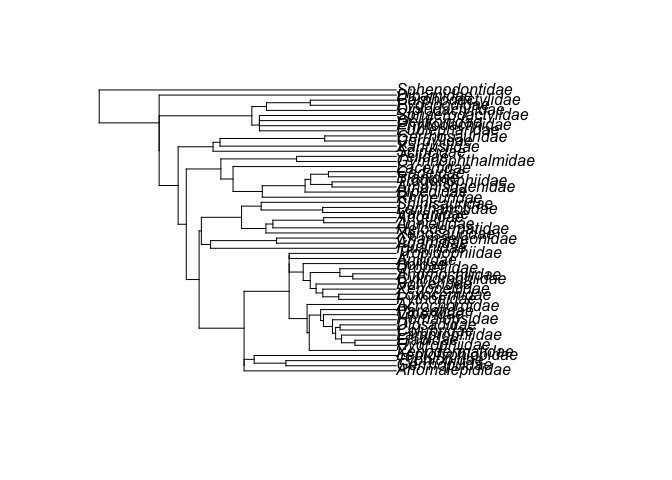

Mapping a continuous trait (field body temperature) onto a phylogeny
====================================================================

This example mirrors the example on bees by Dr. Richards, but these data
are already in the public domain.

Libraries required:

    library(ade4)  # source of example data and tree
    library(ape)   # tree handling
    library(Thermimage) # for access to heat map palette
    library(phytools)

    ## Loading required package: maps

Obtain your phylogeny
---------------------

We'll use the phylogeny for Lepidosauria and then match it to our trait
data.

lepidosauria\_family.nwk was derived from timetime.org by searching for
Lepidosauria and selecting the tree option on the timetree.org website

    tree<-read.tree("lepidosauria_family.nwk")
    tree

    ## 
    ## Phylogenetic tree with 56 tips and 55 internal nodes.
    ## 
    ## Tip labels:
    ##  Anomalepididae, Gerrhopilidae, Typhlopidae, Leptotyphlopidae, Xenodermatidae, Hydrophiidae, ...
    ## Node labels:
    ##  , 126, 127, 110, 88, 78, ...
    ## 
    ## Rooted; includes branch lengths.

    plot(tree)

    tree$tip.label # tip labels

    ##  [1] "Anomalepididae"    "Gerrhopilidae"     "Typhlopidae"      
    ##  [4] "Leptotyphlopidae"  "Xenodermatidae"    "Hydrophiidae"     
    ##  [7] "Elapidae"          "Lamprophiidae"     "Colubridae"       
    ## [10] "Dipsadidae"        "Homalopsidae"      "Viperidae"        
    ## [13] "Pareatidae"        "Acrochordidae"     "Pythonidae"       
    ## [16] "Loxocemidae"       "Xenopeltidae"      "Bolyeridae"       
    ## [19] "Cylindrophiidae"   "Anomochilidae"     "Uropeltidae"      
    ## [22] "Boidae"            "Aniliidae"         "Tropidophiidae"   
    ## [25] "Iguanidae"         "Agamidae"          "Chamaeleonidae"   
    ## [28] "Xenosauridae"      "Helodermatidae"    "Anniellidae"      
    ## [31] "Anguidae"          "Varanidae"         "Lanthanotidae"    
    ## [34] "Shinisauridae"     "Rhineuridae"       "Bipedidae"        
    ## [37] "Amphisbaenidae"    "Trogonophiidae"    "Blanidae"         
    ## [40] "Cadeidae"          "Lacertidae"        "Gymnophthalmidae" 
    ## [43] "Teiidae"           "Scincidae"         "Xantusiidae"      
    ## [46] "Cordylidae"        "Gerrhosauridae"    "Eublepharidae"    
    ## [49] "Phyllodactylidae"  "Gekkonidae"        "Sphaerodactylidae"
    ## [52] "Diplodactylidae"   "Pygopodidae"       "Carphodactylidae" 
    ## [55] "Dibamidae"         "Sphenodontidae"

Mapping Tb trait onto tree
--------------------------

Load in trait data, and assign the family names (column 1) as row.names

    lizards <- read.csv("Clusella Trullas Review Table 1.csv", row.names=1)
    lizards

    ##                     Tb TbSD TbN   Tp TpSD TpN
    ## Agamidae          33.9 3.50  23 35.2  3.3  20
    ## Amphisbaenidae    23.6   NA   1 21.3  0.1   2
    ## Anguidae          27.4 5.20   6 30.0   NA   2
    ## Anniellidae       21.0   NA   1 24.5   NA   1
    ## Carphodactylidae  23.4 2.95   5 26.1  1.6   2
    ## Chamaeleonidae    28.0 3.70  10 31.1  2.4  11
    ## Cordylidae        28.4 0.90   5 32.7  0.9   7
    ## Corytophanidae    30.8 4.50   3   NA   NA  NA
    ## Crotaphytidae     37.8 0.30   3 33.5   NA   1
    ## Diplodactylidae   25.4 5.10  15 31.9  3.6   6
    ## Eublepharidae     26.1 2.10   5 27.0  3.4   9
    ## Gekkonidae        28.5 4.90  13 29.8  3.3  15
    ## Gerrhosauridae    32.2 1.90   3   NA   NA  NA
    ## Gymnophthalmidae  27.0 2.60   9   NA   NA  NA
    ## Helodermatidae    29.8 0.60   2 28.7   NA   1
    ## Iguanidae         37.5 1.80   7 35.8  2.6   7
    ## Lacertidae        34.9 2.90  31 34.1  1.7  24
    ## Lanthanotidae     28.0   NA   1   NA   NA  NA
    ## Leiocephalidae    36.3   NA   1   NA   NA  NA
    ## Liolaemidae       33.8 2.40  74 34.3  2.1  13
    ## Opluridae         38.2 2.20   2   NA   NA  NA
    ## Phrynosomatidae   34.9 2.10  59 35.1  2.2  20
    ## Phyllodactylidae  25.7 4.40  11 31.5  1.9   5
    ## Polychrotidae     29.4 2.60  44 29.3  2.7  10
    ## Pygopodidae       24.9   NA   1   NA   NA  NA
    ## Scincidae         31.4 4.00  72 31.0  3.3  58
    ## Sphaerodactylidae 30.4 4.20   9   NA   NA  NA
    ## Sphenodontidae    14.5   NA   1   NA   NA  NA
    ## Teiidae           37.7 2.30  36 37.0  2.2   7
    ## Trogonophiidae    22.0   NA   1 22.5   NA   1
    ## Tropiduridae      33.6 2.70  21 34.6  1.6  11
    ## Varanidae         35.0 2.70  19 35.0  1.6   8
    ## Xantusiidae       23.6 3.10   4 28.9  2.0   3
    ## Xenosauridae      23.0 1.90   4   NA   NA  NA

    sort(tree$tip.label)

    ##  [1] "Acrochordidae"     "Agamidae"          "Amphisbaenidae"   
    ##  [4] "Anguidae"          "Aniliidae"         "Anniellidae"      
    ##  [7] "Anomalepididae"    "Anomochilidae"     "Bipedidae"        
    ## [10] "Blanidae"          "Boidae"            "Bolyeridae"       
    ## [13] "Cadeidae"          "Carphodactylidae"  "Chamaeleonidae"   
    ## [16] "Colubridae"        "Cordylidae"        "Cylindrophiidae"  
    ## [19] "Dibamidae"         "Diplodactylidae"   "Dipsadidae"       
    ## [22] "Elapidae"          "Eublepharidae"     "Gekkonidae"       
    ## [25] "Gerrhopilidae"     "Gerrhosauridae"    "Gymnophthalmidae" 
    ## [28] "Helodermatidae"    "Homalopsidae"      "Hydrophiidae"     
    ## [31] "Iguanidae"         "Lacertidae"        "Lamprophiidae"    
    ## [34] "Lanthanotidae"     "Leptotyphlopidae"  "Loxocemidae"      
    ## [37] "Pareatidae"        "Phyllodactylidae"  "Pygopodidae"      
    ## [40] "Pythonidae"        "Rhineuridae"       "Scincidae"        
    ## [43] "Shinisauridae"     "Sphaerodactylidae" "Sphenodontidae"   
    ## [46] "Teiidae"           "Trogonophiidae"    "Tropidophiidae"   
    ## [49] "Typhlopidae"       "Uropeltidae"       "Varanidae"        
    ## [52] "Viperidae"         "Xantusiidae"       "Xenodermatidae"   
    ## [55] "Xenopeltidae"      "Xenosauridae"

    length(tree$tip.label)

    ## [1] 56

    rownames(lizards)

    ##  [1] "Agamidae"          "Amphisbaenidae"    "Anguidae"         
    ##  [4] "Anniellidae"       "Carphodactylidae"  "Chamaeleonidae"   
    ##  [7] "Cordylidae"        "Corytophanidae"    "Crotaphytidae"    
    ## [10] "Diplodactylidae"   "Eublepharidae"     "Gekkonidae"       
    ## [13] "Gerrhosauridae"    "Gymnophthalmidae"  "Helodermatidae"   
    ## [16] "Iguanidae"         "Lacertidae"        "Lanthanotidae"    
    ## [19] "Leiocephalidae"    "Liolaemidae"       "Opluridae"        
    ## [22] "Phrynosomatidae"   "Phyllodactylidae"  "Polychrotidae"    
    ## [25] "Pygopodidae"       "Scincidae"         "Sphaerodactylidae"
    ## [28] "Sphenodontidae"    "Teiidae"           "Trogonophiidae"   
    ## [31] "Tropiduridae"      "Varanidae"         "Xantusiidae"      
    ## [34] "Xenosauridae"

    nrow(lizards)

    ## [1] 34

We have 56 taxa in the phylogeny, but only 34 data points in file for
temperature data. Lepidosauria include lizards, snakes, tuatara, whereas
the data file from Clusella-Trullas and Chown (2014) focused on lizard
families, but has multiple subtaxa within the Iguanidae, so the
intersection of the two data sets will be smaller than 34, and we will
lose data for these extra taxa.

Create a variable called **both** that describes which taxa are found in
both:

    both <- intersect(tree$tip.label, rownames(lizards))
    both

    ##  [1] "Iguanidae"         "Agamidae"          "Chamaeleonidae"   
    ##  [4] "Xenosauridae"      "Helodermatidae"    "Anniellidae"      
    ##  [7] "Anguidae"          "Varanidae"         "Lanthanotidae"    
    ## [10] "Amphisbaenidae"    "Trogonophiidae"    "Lacertidae"       
    ## [13] "Gymnophthalmidae"  "Teiidae"           "Scincidae"        
    ## [16] "Xantusiidae"       "Cordylidae"        "Gerrhosauridae"   
    ## [19] "Eublepharidae"     "Phyllodactylidae"  "Gekkonidae"       
    ## [22] "Sphaerodactylidae" "Diplodactylidae"   "Pygopodidae"      
    ## [25] "Carphodactylidae"  "Sphenodontidae"

Create a tree that is matched to the data by only selecting those found
in both:

    tree.matched <- root(drop.tip(tree, setdiff(tree$tip.label, both)), outgroup="Sphenodontidae")
    tree.matched

    ## 
    ## Phylogenetic tree with 26 tips and 25 internal nodes.
    ## 
    ## Tip labels:
    ##  Iguanidae, Agamidae, Chamaeleonidae, Xenosauridae, Helodermatidae, Anniellidae, ...
    ## Node labels:
    ##  , 127, 110, 88, 64, 54, ...
    ## 
    ## Rooted; includes branch lengths.

    plot(tree.matched)

Data in the lizards data frame is not in the same order as the tips from
tree, so create a data.frame, **dat** that extracts only the data that
corresponds to the taxa in **both**:

    dat <- lizards[both, ]
    rownames(dat)

    ##  [1] "Iguanidae"         "Agamidae"          "Chamaeleonidae"   
    ##  [4] "Xenosauridae"      "Helodermatidae"    "Anniellidae"      
    ##  [7] "Anguidae"          "Varanidae"         "Lanthanotidae"    
    ## [10] "Amphisbaenidae"    "Trogonophiidae"    "Lacertidae"       
    ## [13] "Gymnophthalmidae"  "Teiidae"           "Scincidae"        
    ## [16] "Xantusiidae"       "Cordylidae"        "Gerrhosauridae"   
    ## [19] "Eublepharidae"     "Phyllodactylidae"  "Gekkonidae"       
    ## [22] "Sphaerodactylidae" "Diplodactylidae"   "Pygopodidae"      
    ## [25] "Carphodactylidae"  "Sphenodontidae"

Plot continuous trait onto phylogeny
------------------------------------

First, create a vector corresponding to the trait Tb and assign the
names to this vector:

    Tb<-dat$Tb
    names(Tb)<-tree.matched$tip.label

Use the contMap function to create an object that is your plot, but we
need to make further adjustments below, so set plot=F initially.

    objTb<-contMap(tree.matched, Tb, plot=F, type="fan", invert=T, res=300,
                   lims=c(22,38))

Invert refers to the colour palette direction. We set this to FALSE to
change the direction from the normal (warm temperatures will then be a
warm colour).

The res value above sets the resolution of the colour mapping onto the
continuous trait. A higher res will create a smoother gradient, but
colour palettes are sometimes simply a limited number of values and we
need to upsample any palette we use to the number of required colour
values in the continuous trait.

In this case objTb$cols has a length of 1001, so we need to create a
colour palette that is that length by filling in values derived from the
selected colour palette.

    phylopalette<-ironbowpal 
    n<-length(objTb$cols)
    paln<-length(phylopalette)
    ind<-floor(seq(1, paln, paln/(n+floor(n/paln))))
    objTb$cols[1:n]<-phylopalette[ind]

Then plot the Phylogram of Tb onto the Lizard Family phylogeny, either
using a fan or a phylogram facing rightwards:

    plot(objTb, type="fan",  fsize=0.7, outline=F, leg.txt="Tb", offset=1,
         Vars=T)

    plot(objTb, type="phylogram", direction="rightwards", fsize=0.7, outline=F, leg.txt="Tb", offset=1,
         Vars=T)

Warning
-------

This field is not my area of expertise, so use the above example merely
as an introduction to this topic. Feel free to make suggestions or
improvements.

Reference
---------

Data on Tb were obtained from Clusella-Trullas and Chown, 2014:

CLUSELLA-TRULLAS, S. & CHOWN, S. L. (2014). Lizard thermal trait
variation at multiple scales: a review. Journal of Comparative
Physiology B-Biochemical Systemic and Environmental Physiology 184,
5-21.
