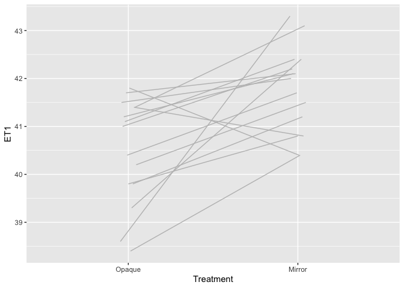

    rm(list=ls())

    # http://r-statistics.co/Top50-Ggplot2-Visualizations-MasterList-R-Code.html

    # Libraries used
    library(lme4)

    ## Loading required package: Matrix

    # library(lmerTest) # we use this below but it conflicts with lme4's lmer function
    library(effects)

    ## Loading required package: carData

    ## lattice theme set by effectsTheme()
    ## See ?effectsTheme for details.

    library(ggplot2)
    library(dplyr)

    ## 
    ## Attaching package: 'dplyr'

    ## The following objects are masked from 'package:stats':
    ## 
    ##     filter, lag

    ## The following objects are masked from 'package:base':
    ## 
    ##     intersect, setdiff, setequal, union

    # Load in data
    setwd("~/Dropbox/ARGHCodingClub/ggplot")
    d<-read.csv("RivulusMirrorET.csv")

    # File containing the Emersion Threshold Data from fish heated in the
    # presence of a mirror under-water
    # Hypothesis: Reflection and social behaviours interfere with decision to leave water 
    # under thermal stress
    str(d)

    ## 'data.frame':    30 obs. of  24 variables:
    ##  $ FishID      : Factor w/ 15 levels "C1-1-19","T1",..: 1 2 8 9 10 11 12 1 2 8 ...
    ##  $ Length.mm   : int  14 28 28 25 29 23 23 14 28 28 ...
    ##  $ Mass.g      : num  0.022 0.28 0.295 0.225 0.344 0.162 0.175 0.022 0.28 0.295 ...
    ##  $ Locale      : Factor w/ 2 levels "Croc1","Tarpin": 1 2 2 2 2 2 2 1 2 2 ...
    ##  $ Date        : Factor w/ 2 levels "22-Apr","23-Apr": 1 1 1 1 1 1 1 1 1 1 ...
    ##  $ Treatment   : Factor w/ 2 levels "Mirror","Opaque": 1 1 1 1 1 2 2 2 2 2 ...
    ##  $ Order       : int  1 1 1 1 1 1 1 2 2 2 ...
    ##  $ RateHeat    : num  1 0.8 0.882 0.9 1 ...
    ##  $ ExptDuration: int  11 10 11 11 9 9 11 9 11 11 ...
    ##  $ SENum       : int  2 13 24 12 7 22 38 26 24 23 ...
    ##  $ BSNum       : int  0 6 6 4 3 9 13 7 2 5 ...
    ##  $ ENum        : int  1 1 1 1 1 2 2 1 1 1 ...
    ##  $ LDNum       : int  6 16 21 17 29 0 0 0 0 0 ...
    ##  $ MCNum       : int  10 1 0 2 7 0 0 0 0 0 ...
    ##  $ SET1        : num  42.7 39.6 37.5 37.5 38.3 31.8 32.1 32.2 33.5 31.7 ...
    ##  $ BST1        : num  NA 40.5 38.4 38.5 38.5 34.6 34.1 35.1 38 38 ...
    ##  $ ET1         : num  43.3 42 40.8 40.4 40.4 39.3 39.8 38.6 41.5 39.8 ...
    ##  $ LDT1        : num  32.9 32.2 31.5 31.2 30.5 NA NA NA NA NA ...
    ##  $ MCT1        : num  32.5 34.5 NA 35.2 31.1 NA NA NA NA NA ...
    ##  $ SETMed      : num  43 41 38.9 39 39.7 ...
    ##  $ BSTMed      : num  NA 41.2 39.7 39.6 39.1 ...
    ##  $ ETMed       : num  43.3 42 40.8 40.4 40.4 ...
    ##  $ LDTMed      : num  38.2 37.4 34.7 32.8 32.6 ...
    ##  $ MCTMed      : num  36.6 34.5 NA 35.9 36.1 ...

    # Factorise
    d$Order<-factor(d$Order)
    d$Treatment<-relevel(d$Treatment, ref="Opaque")

    # Calculate rates of behaviours per min
    d$SENum<-d$SENum/d$ExptDuration
    d$BSNum<-d$BSNum/d$ExptDuration
    d$SurfaceScore<-d$SENum+d$BSNum
    d$MirrorScore<-d$MCNum+d$LDNum
    # SE = Surface Excursion
    # BS = Break Surface
    # Normalise the counts to the duration of the experiment

    # Create two functions to allow 95% CI to be calculated
    lower<-function(x){
      xbar<-mean(x)
      se<-sd(x)/sqrt(length(x))
      lwr<-xbar-1.96*se
      return(lwr)
    }

    upper<-function(x){
      xbar<-mean(x)
      se<-sd(x)/sqrt(length(x))
      lwr<-xbar+1.96*se
      return(lwr)
    }

    # summarise data using dplyr piping (%>%)
    ds<-d[c("Treatment", "ET1")] %>%
      group_by(Treatment) %>%
      summarise_all(funs(mean, lower, upper))

    ## Warning: funs() is soft deprecated as of dplyr 0.8.0
    ## Please use a list of either functions or lambdas: 
    ## 
    ##   # Simple named list: 
    ##   list(mean = mean, median = median)
    ## 
    ##   # Auto named with `tibble::lst()`: 
    ##   tibble::lst(mean, median)
    ## 
    ##   # Using lambdas
    ##   list(~ mean(., trim = .2), ~ median(., na.rm = TRUE))
    ## This warning is displayed once per session.

    ds

    ## # A tibble: 2 x 4
    ##   Treatment  mean lower upper
    ##   <fct>     <dbl> <dbl> <dbl>
    ## 1 Opaque     40.5  39.9  41.1
    ## 2 Mirror     41.8  41.3  42.2

    # Model Fits ####
    lmET1<-lmer(ET1 ~ Treatment + Order + (1|FishID), data=d)
    # Explicitly call lmerTest's lmer function:
    lmET1<-lmerTest::lmer(ET1 ~ Treatment + (1|FishID), data=d)
    summary(lmET1)

    ## Linear mixed model fit by REML. t-tests use Satterthwaite's method [
    ## lmerModLmerTest]
    ## Formula: ET1 ~ Treatment + (1 | FishID)
    ##    Data: d
    ## 
    ## REML criterion at convergence: 85.6
    ## 
    ## Scaled residuals: 
    ##     Min      1Q  Median      3Q     Max 
    ## -2.0177 -0.6717  0.2549  0.6635  1.5482 
    ## 
    ## Random effects:
    ##  Groups   Name        Variance Std.Dev.
    ##  FishID   (Intercept) 0.02664  0.1632  
    ##  Residual             1.00141  1.0007  
    ## Number of obs: 30, groups:  FishID, 15
    ## 
    ## Fixed effects:
    ##                 Estimate Std. Error      df t value Pr(>|t|)    
    ## (Intercept)      40.5067     0.2618 27.9813  154.73  < 2e-16 ***
    ## TreatmentMirror   1.2533     0.3654 13.9897    3.43  0.00407 ** 
    ## ---
    ## Signif. codes:  0 '***' 0.001 '**' 0.01 '*' 0.05 '.' 0.1 ' ' 1
    ## 
    ## Correlation of Fixed Effects:
    ##             (Intr)
    ## TretmntMrrr -0.698

    anova(lmET1, ddf="Satterthwaite")

    ## Type III Analysis of Variance Table with Satterthwaite's method
    ##           Sum Sq Mean Sq NumDF DenDF F value   Pr(>F)   
    ## Treatment 11.781  11.781     1 13.99  11.765 0.004067 **
    ## ---
    ## Signif. codes:  0 '***' 0.001 '**' 0.01 '*' 0.05 '.' 0.1 ' ' 1

    # Model effects (i.e. the predicted values + 95% CI)
    effET1<-Effect("Treatment", lmET1)

    # put model effects into a data.frame for ggplotting
    effET1<-data.frame(Effect("Treatment", lmET1), P=c("P = 0.0041", NA))
    str(effET1)

    ## 'data.frame':    2 obs. of  6 variables:
    ##  $ Treatment: Factor w/ 3 levels "Mirror","Opaque",..: 2 1
    ##  $ fit      : num  40.5 41.8
    ##  $ se       : num  0.262 0.262
    ##  $ lower    : num  40 41.2
    ##  $ upper    : num  41 42.3
    ##  $ P        : Factor w/ 1 level "P = 0.0041": 1 NA

    effET1

    ##   Treatment      fit        se    lower    upper          P
    ## 1    Opaque 40.50667 0.2617945 39.97040 41.04293 P = 0.0041
    ## 2    Mirror 41.76000 0.2617945 41.22374 42.29626       <NA>

    # Emersion Threshold Figure ####

    dodge<-position_dodge(width=.1)
    ET1.plot<-ggplot()+
      geom_line(data=d, aes(x=Treatment, y=ET1,  group=FishID), 
                col="grey", position=dodge)
    ET1.plot

    ET1.plot<-ggplot()+
      geom_line(data=d, aes(x=Treatment, y=ET1, group=FishID), col="grey", position=dodge)+
      geom_point(data=d, aes(x=Treatment, y=ET1, fill=Treatment, group=FishID), shape=21, position=dodge, size=0.5)
    ET1.plot

    ET1.plot<-ggplot()+
      geom_line(data=d, aes(x=Treatment, y=ET1, group=FishID), col="grey", position=dodge)+
      geom_point(data=d, aes(x=Treatment, y=ET1, fill=Treatment, group=FishID), shape=21, position=dodge, size=0.5)+
      geom_errorbar(data=effET1, aes(x=Treatment, ymin=lower, ymax=upper), width=0.05, size=0.5)+
      geom_point(data=effET1, aes(x=Treatment, y=fit, fill=Treatment), col="black", shape=21, size=3)
    ET1.plot

    # Using the model effects:
    ET1.plot<-ggplot()+
      geom_line(data=d, aes(x=Treatment, y=ET1, group=FishID), col="grey", position=dodge)+
      geom_point(data=d, aes(x=Treatment, y=ET1, fill=Treatment, group=FishID), shape=21, position=dodge, size=0.5)+
      geom_errorbar(data=effET1, aes(x=Treatment, ymin=lower, ymax=upper), width=0.05, size=0.5)+
      geom_point(data=effET1, aes(x=Treatment, y=fit, fill=Treatment), col="black", shape=21, size=3)+
      annotate("label", x=1.5, y=43.5, label = effET1$P[1], size=3, label.size=NA)+
      scale_fill_manual(values=c("black", "white"), name="", guide=F)+
      ylab("Emersion\nTemperature (°C)")+
      xlab("Treatment")+
      ylim(39,43.5)+
      theme_classic()+
      #  ggtheme(10,0.3)+
      theme(legend.position=c(0.15,0.85))+
      theme(panel.border = element_rect(fill=NA, colour=NA))
    ET1.plot

    ## Warning: Removed 2 rows containing missing values (geom_path).

    ## Warning: Removed 2 rows containing missing values (geom_point).

    # Using the group means +- se values: 
    ET1.plot<-ggplot()+
      geom_line(data=d, aes(x=Treatment, y=ET1, group=FishID), 
                col="grey", position=dodge)+
      geom_point(data=d, aes(x=Treatment, y=ET1, fill=Treatment, group=FishID),
                 shape=21, position=dodge, size=0.5)+
      geom_errorbar(data=ds, aes(x=Treatment, ymin=lower, ymax=upper), 
                    width=0.05, size=0.5)+
      geom_point(data=ds, aes(x=Treatment, y=mean, fill=Treatment), 
                 col="black", shape=21, size=3)+
      #annotate("label", x=1.5, y=43.5, label = effET1$P[1], size=3, label.size=NA)+
      scale_fill_manual(values=c("black", "white"), name="", guide=F)+
      ylab("Emersion\nTemperature (°C)")+
      xlab("Treatment")+
      ylim(39,43.5)+
      theme_classic()+
      #  ggtheme(10,0.3)+
      theme(legend.position=c(0.15,0.85))+
      theme(panel.border = element_rect(fill=NA, colour=NA))
    ET1.plot

    ## Warning: Removed 2 rows containing missing values (geom_path).

    ## Warning: Removed 2 rows containing missing values (geom_point).

    save(ET1.plot, file="Mygraph.Rda")

    ggsave("Figure 1 - Mirror vs Opaque Emersion Thresholds_4x4in.pdf", 
           ET1.plot,  width=4, height=4)

    ## Warning: Removed 2 rows containing missing values (geom_path).

    ## Warning: Removed 2 rows containing missing values (geom_point).

    ggsave("Figure 1 - Mirror vs Opaque Emersion Thresholds_4x4cm.pdf", 
           ET1.plot,  width=4, height=4, units="cm")

    ## Warning: Removed 2 rows containing missing values (geom_path).

    ## Warning: Removed 2 rows containing missing values (geom_point).

    ggsave("Figure 1 - Mirror vs Opaque Emersion Thresholds_4x4in.tiff",
           ET1.plot, width=4, height=4)

    ## Warning: Removed 2 rows containing missing values (geom_path).

    ## Warning: Removed 2 rows containing missing values (geom_point).

    ggsave("Figure 1 - Mirror vs Opaque Emersion Thresholds_4x4in_600dpi.tiff",
           dpi=600,
           ET1.plot, width=4, height=4)

    ## Warning: Removed 2 rows containing missing values (geom_path).

    ## Warning: Removed 2 rows containing missing values (geom_point).

    ggsave("Figure 1 - Mirror vs Opaque Emersion Thresholds_4x4cm.tiff",
           dpi=600, 
           ET1.plot, width=4, height=4, units="cm")

    ## Warning: Removed 2 rows containing missing values (geom_path).

    ## Warning: Removed 2 rows containing missing values (geom_point).

    # Using Vector based graphics (pdf, eps) - the output is mostly scaleable, but 
    # exported sizes of fonts will need tweaking
    # Using Raster Graphics output (tiff, png, jpg, bmp) will require a lot of
    # trial and error to get sizes of lines, points, and fonts correct

    ET1.plot+ 
      xlab("Fish Treatment")

    ## Warning: Removed 2 rows containing missing values (geom_path).

    ## Warning: Removed 2 rows containing missing values (geom_point).

    lmSE<-lmer(SurfaceScore ~ Treatment + (1|FishID), d)
    lmSE<-lmerTest::lmer(SurfaceScore ~ Treatment + (1|FishID), d)
    summary(lmSE)

    ## Linear mixed model fit by REML. t-tests use Satterthwaite's method [
    ## lmerModLmerTest]
    ## Formula: SurfaceScore ~ Treatment + (1 | FishID)
    ##    Data: d
    ## 
    ## REML criterion at convergence: 109.5
    ## 
    ## Scaled residuals: 
    ##     Min      1Q  Median      3Q     Max 
    ## -1.0965 -0.4339 -0.1476  0.2599  3.4177 
    ## 
    ## Random effects:
    ##  Groups   Name        Variance Std.Dev.
    ##  FishID   (Intercept) 0.8038   0.8965  
    ##  Residual             1.7387   1.3186  
    ## Number of obs: 30, groups:  FishID, 15
    ## 
    ## Fixed effects:
    ##                 Estimate Std. Error      df t value Pr(>|t|)    
    ## (Intercept)       3.9895     0.4117 25.4559   9.690 5.03e-10 ***
    ## TreatmentMirror  -2.1152     0.4815 14.0000  -4.393 0.000613 ***
    ## ---
    ## Signif. codes:  0 '***' 0.001 '**' 0.01 '*' 0.05 '.' 0.1 ' ' 1
    ## 
    ## Correlation of Fixed Effects:
    ##             (Intr)
    ## TretmntMrrr -0.585

    anova(lmSE, ddf="Satterthwaite")

    ## Type III Analysis of Variance Table with Satterthwaite's method
    ##           Sum Sq Mean Sq NumDF DenDF F value    Pr(>F)    
    ## Treatment 33.557  33.557     1    14    19.3 0.0006128 ***
    ## ---
    ## Signif. codes:  0 '***' 0.001 '**' 0.01 '*' 0.05 '.' 0.1 ' ' 1

    effSE<-data.frame(Effect("Treatment", lmSE), P=c("P = 0.00061", NA))

    SE_emersion.plot<-ggplot()+
      geom_line(data=d, aes(x=Treatment, y=SurfaceScore, group=FishID), col="grey", position=dodge)+
      geom_point(data=d, aes(x=Treatment, y=SurfaceScore, fill=Treatment, group=FishID), shape=21, position=dodge, size=0.5)+
      geom_errorbar(data=effSE, aes(x=Treatment, ymin=lower, ymax=upper), width=0.05, size=0.5)+
      geom_point(data=effSE, aes(x=Treatment, y=fit, fill=Treatment), col="black", shape=21, size=3)+
      annotate("label", x=1.5, y=10, label = effSE$P[1], size=3, label.size=NA)+
      scale_fill_manual(values=c("black", "white"), name="", guide=F)+
      scale_y_continuous(breaks=c(0,2,4,6,8,10))+
      ylab(expression("Surface Behaviours (min"^-1*")", adj=0.5))+ 
      xlab("Treatment")+
      #  ggtheme(10,0.3)+
      theme_classic()+
      theme(legend.position=c(0.15,0.85))+
      theme(panel.border = element_rect(fill=NA, colour=NA))
    SE_emersion.plot

    library(cowplot)

    ## 
    ## ********************************************************

    ## Note: As of version 1.0.0, cowplot does not change the

    ##   default ggplot2 theme anymore. To recover the previous

    ##   behavior, execute:
    ##   theme_set(theme_cowplot())

    ## ********************************************************

    biplot<-plot_grid(ET1.plot, SE_emersion.plot, labels=c("a)", "b)"))

    ## Warning: Removed 2 rows containing missing values (geom_path).

    ## Warning: Removed 2 rows containing missing values (geom_point).

    biplot

    ggsave("Figure 2.pdf", biplot, width=8, height=4)

    SE_emersion.plot+theme_grey()

    biplot+theme_grey()

    biplot+theme_bw()

    library(ggthemes)

    ## 
    ## Attaching package: 'ggthemes'

    ## The following object is masked from 'package:cowplot':
    ## 
    ##     theme_map

    ET1.plot+theme_economist()

    ## Warning: Removed 2 rows containing missing values (geom_path).

    ## Warning: Removed 2 rows containing missing values (geom_point).

    ET1.plot+theme_gdocs()

    ## Warning: Removed 2 rows containing missing values (geom_path).

    ## Warning: Removed 2 rows containing missing values (geom_point).

    # ggtheme settings ####
    ggtheme <- function(base_size=12, base_line=0.3) {
      #theme_bw() %+replace%
      theme(
        
        text =        element_text(size=base_size),
        line =        element_line(size=base_line, linetype="solid"),
        
        axis.text.x = element_text(size=base_size*0.8, colour='black',  hjust=0.5, vjust=1, angle=0),
        axis.text.y = element_text(size=base_size*0.8, colour='black', hjust=1, vjust=0.5, angle=0),
        axis.line.x = element_line(size=base_line),
        axis.line.y = element_line(size=base_line),
        
        axis.title.x =  element_text(size = base_size, vjust = 1, margin=unit(c(3,0,0,0),"mm")),
        axis.title.y =  element_text(size = base_size, angle = 90, vjust = 0.5, margin=unit(c(0,3,0,0),"mm")),
        axis.ticks = element_line(size=base_line),
        axis.ticks.length = unit(0.3, "lines"),
        
        panel.background = element_blank(),
        #panel.grid.minor = element_line(colour='#EEEEEE', linetype="solid", size=base_line),
        panel.grid.minor = element_blank(),
        panel.grid.major = element_blank(),
        panel.border     = element_rect(fill=NA, colour=NA, size=base_line),
        panel.spacing    = unit(1, "lines"),
        
        legend.background = element_rect(fill="transparent", colour="transparent"),
        legend.key =       element_rect(fill="transparent", colour="transparent"),
        legend.text=       element_text(size=base_size),
        
        strip.background =  element_blank(),
        strip.text.x =      element_text(size = base_size * 0.8),
        strip.text.y =      element_text(size = base_size * 0.8, angle = -90),
        strip.switch.pad.grid = unit(0, "mm"),
        strip.switch.pad.wrap = unit(0, "mm"),
        
        plot.margin =       unit(c(0.5, 0.5, 0.5, 0.5), "cm"),
        plot.title =        element_text(size = base_size * 1.2),
        plot.background =   element_rect(colour = "transparent", fill="transparent", size=base_line)
      )}

    ET1.plot+ggtheme(12, 0.1)

    ## Warning: Removed 2 rows containing missing values (geom_path).

    ## Warning: Removed 2 rows containing missing values (geom_point).

